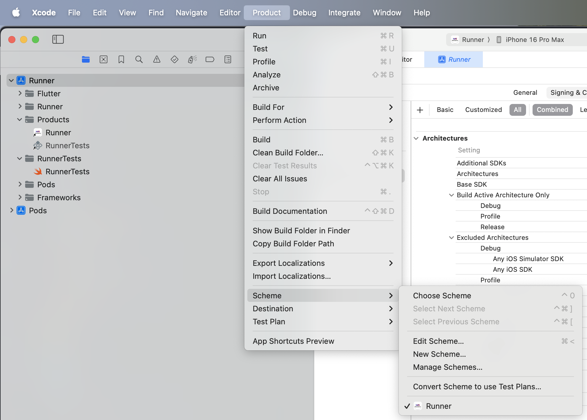
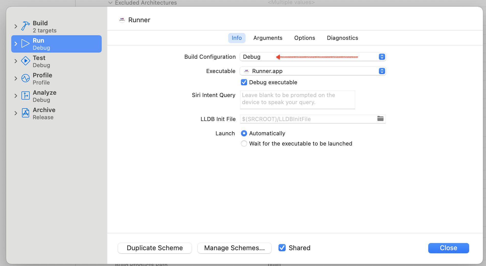
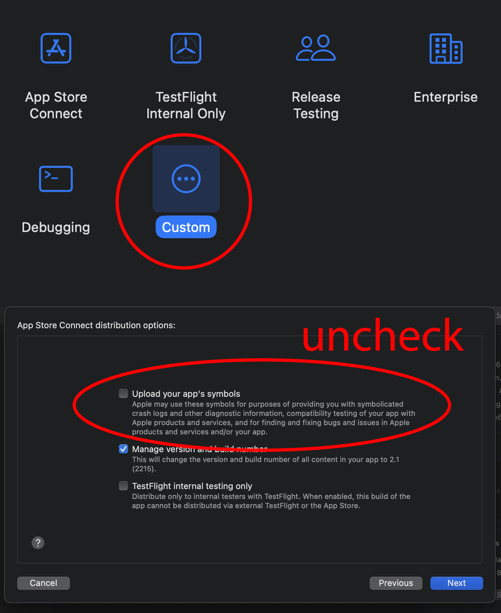

=========================================================================================================
flutter doctor -v

[✓] Flutter (Channel stable, 3.13.9, on macOS 15.1.1 24B91 darwin-arm64, locale
en-US) • Flutter version 3.13.9 on channel stable at
/Users/pinakranjansahoo/development/flutter • Upstream repository
https://github.com/flutter/flutter.git • Framework revision d211f42860 (1 year,
1 month ago), 2023-10-25 13:42:25 -0700 • Engine revision 0545f8705d • Dart
version 3.1.5 • DevTools version 2.25.0

[✓] Android toolchain - develop for Android devices (Android SDK version 34.0.0)
• Android SDK at /Users/pinakranjansahoo/Library/Android/sdk • Platform
android-34, build-tools 34.0.0 • Java binary at: /Applications/Android
Studio.app/Contents/jbr/Contents/Home/bin/java • Java version OpenJDK Runtime
Environment (build 21.0.3+-79915917-b509.11) • All Android licenses accepted.

[✓] Xcode - develop for iOS and macOS (Xcode 16.1) • Xcode at
/Applications/Xcode.app/Contents/Developer • Build 16B40 • CocoaPods version
1.15.2

[✓] Chrome - develop for the web • Chrome at /Applications/Google
Chrome.app/Contents/MacOS/Google Chrome

[✓] Android Studio (version 2024.2) • Android Studio at /Applications/Android
Studio.app/Contents • Flutter plugin can be installed from: 🔨
https://plugins.jetbrains.com/plugin/9212-flutter • Dart plugin can be installed
from: 🔨 https://plugins.jetbrains.com/plugin/6351-dart • Java version OpenJDK
Runtime Environment (build 21.0.3+-79915917-b509.11)

[✓] VS Code (version 1.95.3) • VS Code at /Applications/Visual Studio
Code.app/Contents • Flutter extension version 3.102.0

[✓] Connected device (3 available) • V2230 (mobile) • 10BD290P0U0005H •
android-arm64 • Android 14 (API 34) • macOS (desktop) • macos • darwin-arm64 •
macOS 15.1.1 24B91 darwin-arm64 • Chrome (web) • chrome • web-javascript •
Google Chrome 131.0.6778.87 ! Error: Browsing on the local area network for
Pinak's iPhone. Ensure the device is unlocked and attached with a cable or
associated with the same local area network as this Mac. The device must be
opted into Developer Mode to connect wirelessly. (code -27)

[✓] Network resources • All expected network resources are available.

• No issues found!

=========================================================================================================

java -version

openjdk version "17.0.13" 2024-10-15 OpenJDK Runtime Environment Homebrew (build
17.0.13+0) OpenJDK 64-Bit Server VM Homebrew (build 17.0.13+0, mixed mode,
sharing)

=========================================================================================================

1. ls /Library/Java/JavaVirtualMachines/
2. shows below data
3. # openjdk-17.jdk

=========================================================================================================

1. Set JAVA_HOME Globally

.zshrc file contents

export JAVA_HOME=/Library/Java/JavaVirtualMachines/openjdk-17.jdk/Contents/Home
export PATH=$JAVA_HOME/bin:$PATH

export
PATH="/usr/local/opt/mysql-client/bin:$PATH"
export PATH=$HOME/development/flutter/bin:$PATH
export PATH="/opt/homebrew/opt/ruby/bin:$PATH"
export
PATH="/opt/homebrew/opt/openjdk@21/bin:$PATH"
export JAVA_HOME=$(/usr/libexec/java_home)
export JAVA_HOME=/Library/Java/JavaVirtualMachines/openjdk-17.jdk/Contents/Home
<<<<<<<<<<<<< export
PATH="/opt/homebrew/opt/openjdk@17/bin:$PATH"
export PATH="$PATH":"$HOME/.pub-cache/bin"
export PATH=$JAVA_HOME/bin:$PATH
<<<<<<<<<<<

2. Reload the configuration:
3. source ~/.zshrc
4. Force Gradle to Use Java 17
   1. Edit the android/gradle.properties file in your Flutter project and add
      this line:
   2. org.gradle.java.home=/Library/Java/JavaVirtualMachines/openjdk-17.jdk/Contents/Home

=========================================================================================================

Checked attendance app in new macbook on 05-Dec-2024 it is working in below old
setup

1. flutter_macos_arm64_3.13.9-stable.zip (Old flutter)
2. Android Studio Ladybug | 2024.2.1 Patch 2 (This is latest one as on date)

=========================================================================================================

# Clean Gradle and reinstall

1. cd ~
2. # rm -rf .gradle

=========================================================================================================

# Old Mac Setup

1. flutter: 3.13.9
2. XCode: 15.0.1
3. VS Code: 1.94.2
4. Android Studio: 2022.3.1

5. gradel: 7.5-all

6. Android SDK: 34.0
7. Android NDK: 25.1.8437
8. Command Line: 11.00
9. CMake: 3.18.1
10. OpenJDK: 17, 21

=========================================================================================================

softwareupdate --install-rosetta

PRODUCT>SCHEME>EDIT SCHEME>  

=========================================================================================================
Upload Symbols Failed The archive did not include a dSYM for the
Flutter.framework with the UUIDs [4C4C44C6-5555-3144-A124-89C324693308]. Ensure
that the archive's dSYM folder includes a DWARF file for Flutter.framework with
the expected UUIDs

# 

1. Archive Your App
2. Open the Organizer
3. Select Your Archive
4. Start Distribution Process
5. use custom
6. Uncheck Upload your app’s symbols checkbox
7. Continue with Distribution
